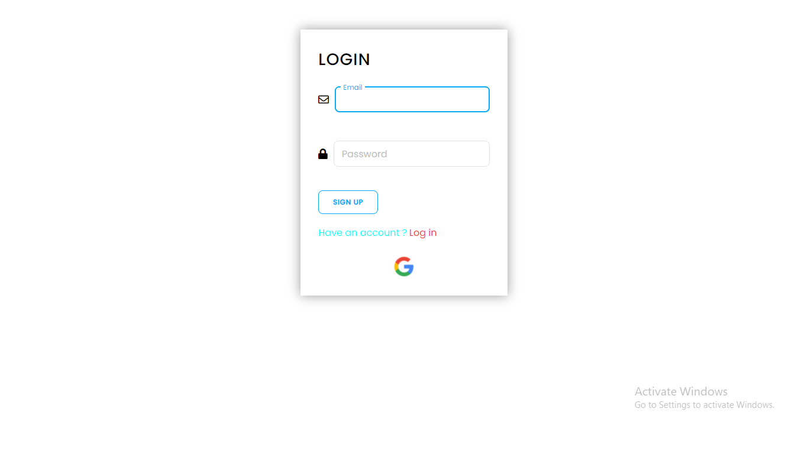
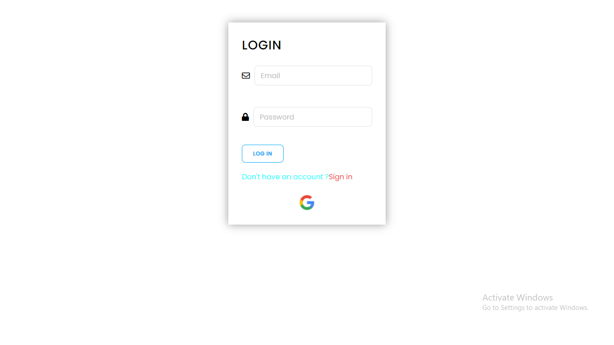
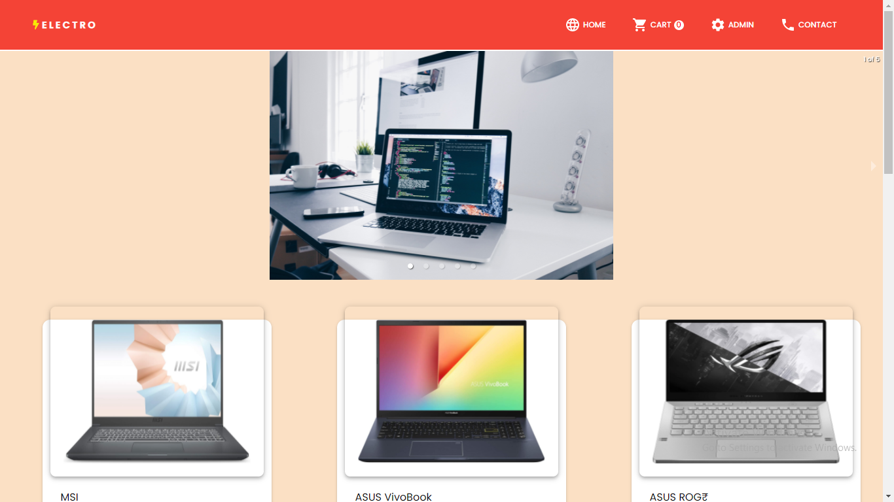
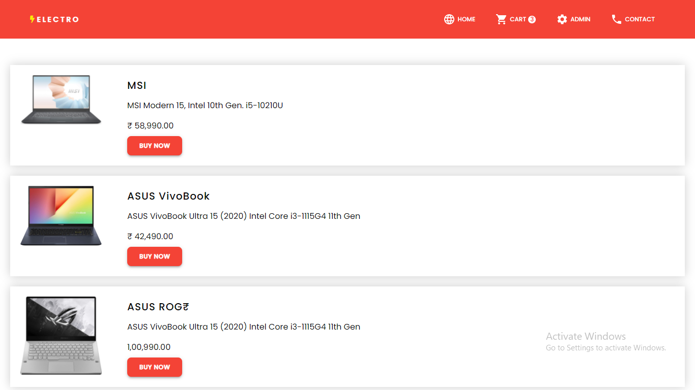
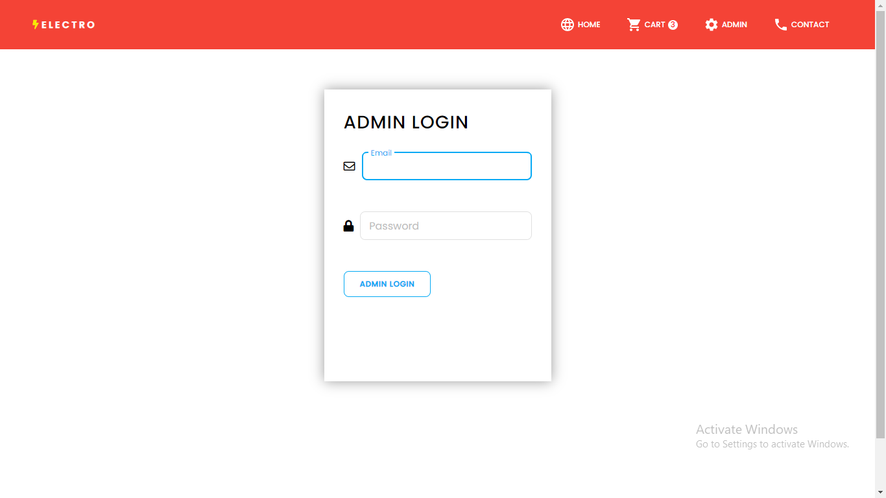
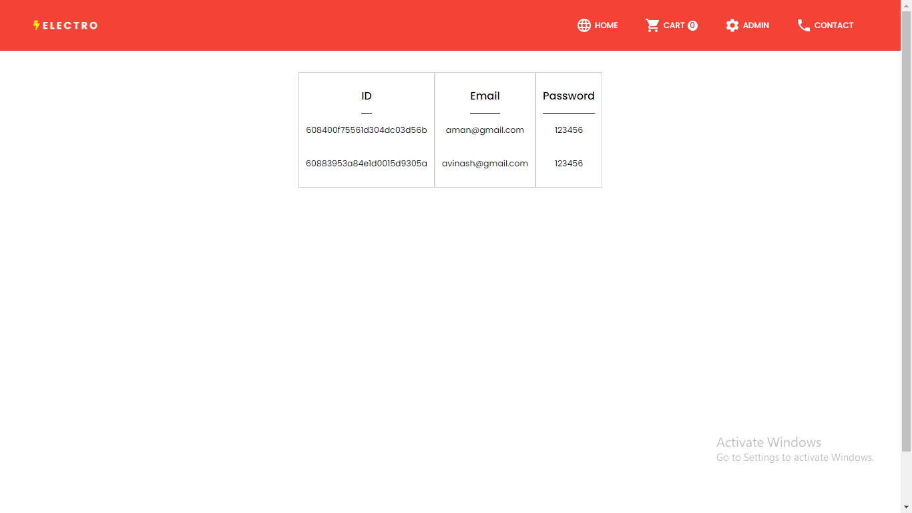
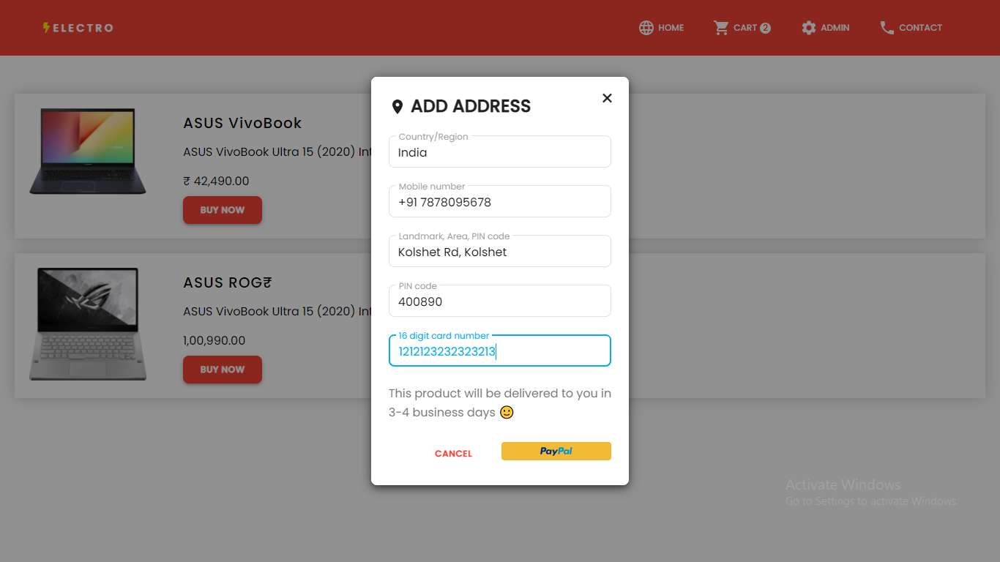
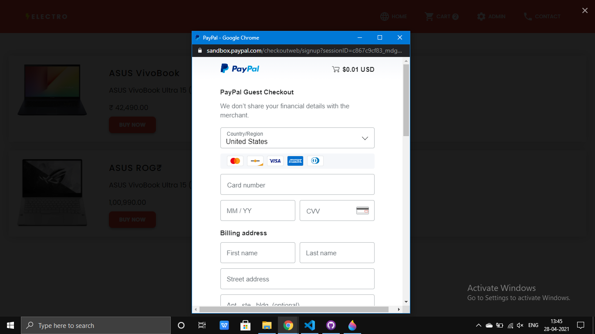
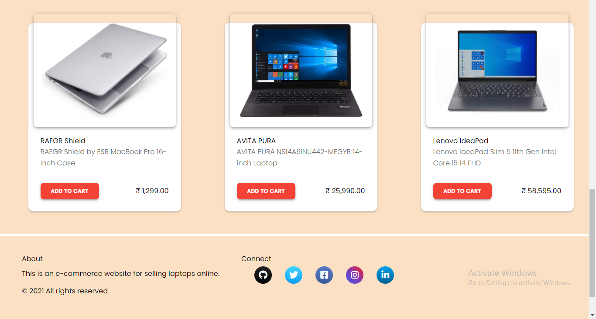
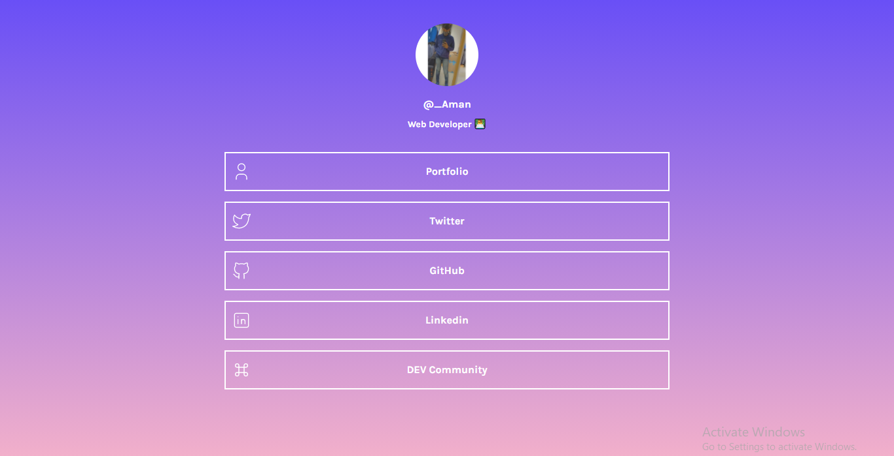

# The frontend is deployed on Netlify and the backend is deployed on Heroku 

## This is a full-stack eCommerce website built using MERN + Material Tailwind
### 1. Log in Page : User Login using MERN or user can login with Google
  

### 2. Sign Up Page : User SignUp using MERN
  

### 3. Home Page

### 4. Cart Page
  

### 5. Admin Login Page

### 6. Admin Panel Page : List of users registered

### 7. Payemt Page : It will only show payPal button only if the card number is valid 
  

### 8. Paypal payment Page

## Tecnologies:

### 9. Products Page

### 10. Contact Page

## Tecnologies:
- **ReactJS** - JavaScript library that is used for building user interfaces specifically for single-page applications.
- **Express** -  Express is a minimal and flexible Node.js web application framework that provides a robust set of features for web and mobile applications.
- **Node** - Node.js® is a JavaScript runtime built on Chrome's V8 JavaScript engine.
- **MongoDB** - The Easiest Way to Deploy, Operate, and Scale MongoDB in the Cloud in Just a Few Clicks..

## Installation and Setup Instructions

Clone down this repository. You will need `node` and `npm` installed globally on your machine.  

Installation:

`npm install`  

To Run Test Suite:  

`npm test`  

To Start Server:

`npm start`  

To Visit App:

`localhost:3000`  
